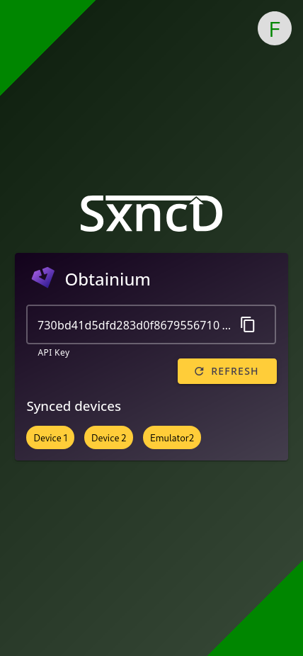

<p align="center">
    
</p>
<br>

# SxncD

An Open Source Synchronization Server for use with any apps that that support a standard file import/export.

<table cellpadding="10" cellspacing="0" border="0" width="100%">
    <tr>
        <td align="right">
            
        </td>
        <td align="left">
            
        </td>
    </tr>
</table>

## Supported apps

<table cellpadding="10" cellspacing="0" border="0">
  <tr>
    <td></td><td>Obtainium<br>(In development)</td>
    <td></td><td>Thunder for Lemmy<br>(In development)</td>
  </tr>
</table>
<br><br>


## Supported authentication providers

<table cellpadding="10" cellspacing="0" border="0">
  <tr>
    <td></td><td>OpenID Connect</td>
    <td></td><td>GitHub</td>
  </tr>
  <tr>
    <td></td><td>Google</td>
    <td colspan=2>&nbsp;</td>
  </tr>
</table>
<br><br>

## Running SxncD

SxncD was built to run in Docker using the `nowsci/sxncd` docker image. A sample [Docker Compose](./docker-compose.yml) file is provided.

## Integrating SxncD with your app
SxncD is built in a modular way to support easy integration into existing mobile and desktop applications.

### Adding apps to the SxncD server
Adding your app to SxncD is easy, simply copy an existing configuration from the [app modules](./src/modules/app) folder and edit for your application before submitting a PR.

### Syncing app data with SxncD
If your application is developed in Flutter, we offer a library to make things easy:
- [Flutter library](https://github.com/Fmstrat/SxncD-flutter)

If your application is built in another language, or for desktop, the API endpoint can be used in any standard HTTP client. The data object for a `POST` exists as:
```
{
  "deviceName": "My Device",              // String | The name of the device
  "savedTs": "1900-01-01T00:00:00.000Z",  // String | The timestamp of when the settings were last saved on the device
  "settings": "..."                       // String | The actual settings
}
```

For example:

```bash
curl -X POST http://<url>/api/v1/sync/update \
    -H "Authorization: <api key>" \
    -H "Content-Type: application/json" \
    -d '{
        "deviceName": "My Device",
        "savedTs": "1900-01-01T00:00:00.000Z",
        "settings": { "settings": true }
    }'
```

Keep in mind the `settings` field can be any format of string or JSON, meaning you can E2E encrypt settings and store them as Base64 as long as you also decrypt when receiving updates:

```bash
curl -X POST http://<url>/api/v1/sync/update \
    -H "Authorization: <api key>" \
    -H "Content-Type: application/json" \
    -d '{
        "deviceName": "My Device",
        "savedTs": "1900-01-01T00:00:00.000Z",
        "settings": "eyAic2V0dGluZ..."
    }'
```

#### API responses
The JSON return object from the API is structured as follows:
```
{
  "success": true,      // boolean       | true/false
  "data": "...",        // String|Object | The settings data being returned
  "action": "created",  // String        | created       | A new settings entry was created.
                        //               | none          | The server-side data and device data are already up to date.
                        //               | existingNewer | The server-side data is newer than what was sent by the device.
                        //               | incomingNewer | The devices data is newer than the server-side data, so the
                        //                                 server has stored this new data.
  "error": "..."        // String        | If success is false, the reason why
}
```
